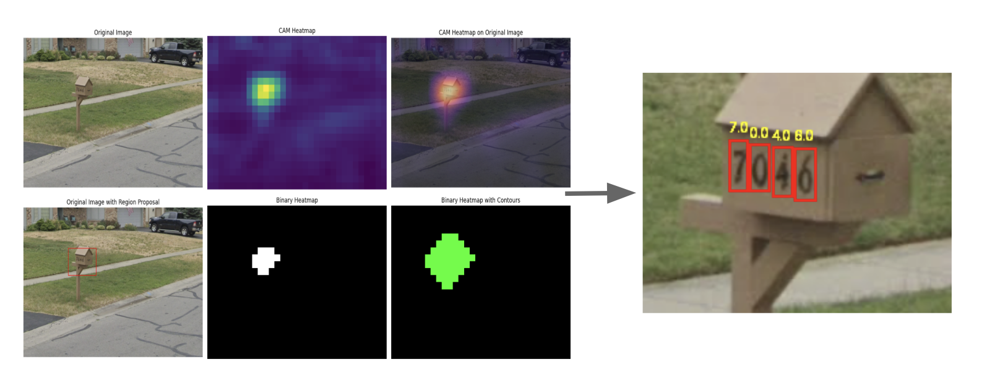

# CAM-YOLO

This is a Two-stage model used to detect house numbers on mailbox in street view images. It uses Class Activation Map (CAM) for regional proposal generation and pre-trained YOLOv3 fine-tuned on the Street View House Number (SVHN) dataset for number detections.

## Example Detection

Please check out 'CAM+YOLOv3.ipynb' notebook for implementation and more visualization.

## Other Notebooks

_ **'YOLOv3.ipynb'**: SVHN dataset pre-processing and pre-trained YOLOv3 fine-tunining. Weights from here (**'best-2.pt'**)is then used in CAM+YOLOv3 model.

- **'FasterRCNN.ipynb'**: Faster R-CNN is also used for number detections with SVHN dataset. Training time is long and the model is not yet well-trained.

## Resources and References

- **YOLOv3 Implementation**: The pre-trained YOLOv3 used is from Ultralytics. Visit their GitHub repository [here](https://github.com/ultralytics/yolov3) for more information.

- **Class Activation Mapping (CAM)**: The CAM implementation and visualization are adapted from [this GitHub repository](https://github.com/JimEverest/CAM) by Jim Everest.

- **Dataset**: Street View House Number (SVHN) dataset (format 1) used is from [here](http://ufldl.stanford.edu/housenumbers/).

- **ImageNet Classes**: 'imagenet_classes.txt' from [here](https://gist.github.com/ageitgey/4e1342c10a71981d0b491e1b8227328b).

- **Image Source**: Image examples used are from Google Street View and are **only for visualization purposes**.
